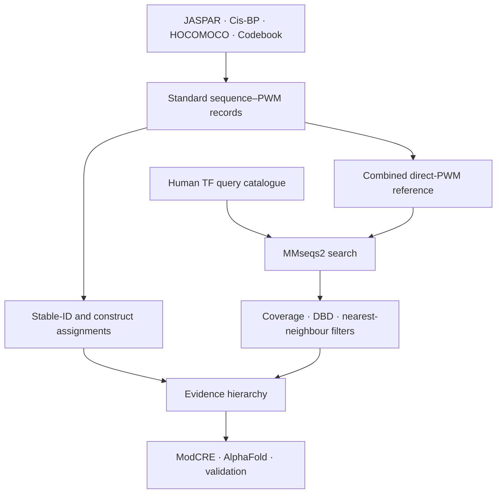

# Hierarchical human TF–PWM annotation

This repository links human transcription factors (TFs) to experimentally derived position weight matrices (PWMs) or structure-based predictions through a fixed evidence hierarchy.

JASPAR, Cis-BP, HOCOMOCO and the human TF Codebook are peer inputs to one direct-PWM workflow. Every source is standardized to the same sequence–motif schema before the reference is searched, and source provenance is retained throughout.

## Current release

The release contains **5,465 unique TF accessions**. Of these, **5,344 (97.8%)** have one retained annotation and **121** remain unannotated.

| Best annotation level | TFs |
|---|---:|
| Direct PWM | 2,395 |
| Homologous PWM | 1,741 |
| Relatively homologous PWM | 602 |
| ModCRE | 372 |
| AlphaFold | 234 |
| Unannotated | 121 |
| **Total** | **5,465** |

The Codebook contribution consists of 177 experimentally derived PWMs, each linked through the final supplementary tables from experiment to plasmid, insert and assayed amino-acid sequence. The pinned accession map assigns these motifs to 236 compatible UniProt accessions: 220 through exact construct containment and 16 through stable Ensembl gene identity. It also ensures one canonical accession for each of the 177 TFs.

Download the main table: [`data/releases/TF_PWM_chart_final.tsv`](data/releases/TF_PWM_chart_final.tsv)

## Canonical workflow



The retained evidence order is:

1. `Direct_PWM`: experimental PWM evidence assigned to the same TF through a stable accession, stable gene ID, exact construct or exact full-sequence relationship;
2. `Homologous_PWM`: nearest compatible PWM reference at ≥70% sequence identity;
3. `Relatively_Homologous_PWM`: nearest compatible PWM reference at ≥50% and <70% identity;
4. `ModCRE`: structure-based ModCRE model for a TF without sequence-based PWM evidence;
5. `AlphaFold`: AlphaFold3-assisted ModCRE model for a TF still unannotated;
6. `Unannotated`.

Homology candidates must cover at least 80% of the reference construct, span at least 40 amino acids and have an E-value ≤1e-5. Known incompatible DNA-binding-domain (DBD) annotations are rejected. Only the top identity/bit-score neighbour and exact ties are retained. The 70% and 50% cutoffs remain project-specific operational thresholds, not universal biological boundaries.

## Repository structure

```text
.
├── data/
│   ├── releases/           # validated annotation table
│   ├── reference/          # source manifest, Codebook provenance and ID/DBD maps
│   └── model_predictions/  # ModCRE/AF3 logs and exclusion lists
├── scripts/                # canonical processing and validation workflow
├── docs/                   # data dictionary and reproducibility notes
└── .github/workflows/      # automated release validation
```

## Pipeline entry points

Prepare all four direct-PWM sources with the common `SOURCE|ACCESSION|MOTIF_ID` FASTA schema:

```bash
python scripts/01_prepare_jaspar.py JASPAR.json jaspar.fasta

python scripts/02_prepare_cisbp.py \
  --motifs CisBP_2.00.all.motifs.sql \
  --proteins CisBP_2.00.all.proteins.sql \
  --accession-map CisBP_2.00.tf_to_uniprot.tsv \
  --output cisbp.fasta

python scripts/03_prepare_hocomoco.py \
  --annotation HOCOMOCOv11_core_annotation_HUMAN_mono.tsv \
  --sequences human_tf_sequences.fasta \
  --output hocomoco.fasta

python scripts/04_prepare_codebook.py \
  --proteins SupplementaryTable1_Proteins.xlsx \
  --inserts SupplementaryTable2_Inserts.xlsx \
  --plasmids SupplementaryTable3_Plasmids.xlsx \
  --experiments SupplementaryTable4_Experiments.xlsx \
  --census SupplementaryTable14_TFCensus.xlsx \
  --output codebook.fasta \
  --metadata-output CODEBOOK_2026_motifs.tsv \
  --census-output CODEBOOK_2026_tf_census.tsv

python scripts/05_merge_reference_fastas.py \
  jaspar.fasta cisbp.fasta hocomoco.fasta codebook.fasta \
  --output direct_pwm_reference.fasta
```

Run the common search and evidence assignment:

```bash
bash scripts/06_run_mmseqs.sh \
  human_tf_sequences.fasta direct_pwm_reference.fasta TF_sequences

python scripts/07_build_homology_table.py \
  --queries human_tf_sequences.fasta \
  --comparison TF_sequences.comparison \
  --direct-assignments data/reference/CODEBOOK_2026_accession_map.tsv \
  --domain-map data/reference/TF_DBD_map.tsv \
  --output TF_PWM_sequence_tiers.tsv \
  --provenance-output TF_PWM_sequence_provenance.tsv

python scripts/08_add_tf_families.py \
  --input TF_PWM_sequence_tiers.tsv \
  --mapping data/reference/TF_accession_family.csv \
  --output TF_PWM_with_families.tsv

python scripts/09_attach_model_predictions.py \
  --input TF_PWM_with_families.tsv \
  --modcre-log data/model_predictions/pwm_execution_modcre_all.log \
  --af3-log data/model_predictions/pwm_execution_af3_all.log \
  --modcre-exclusions data/model_predictions/wrong_model_modcre.txt \
  --af3-exclusions data/model_predictions/wrong_model_af3.txt \
  --output TF_PWM_candidates.tsv

python scripts/10_finalize_release.py \
  --input TF_PWM_candidates.tsv \
  --output TF_PWM_chart_final.tsv
```

Validate the deposited release with:

```bash
python -m pip install -r requirements.txt
python scripts/11_validate_release.py \
  data/releases/TF_PWM_chart_final.tsv \
  --codebook-reference \
  data/reference/CODEBOOK_2026_motifs.tsv \
  data/reference/CODEBOOK_2026_accession_map.tsv \
  data/reference/CODEBOOK_2026_tf_census.tsv
```

## Data and software sources

- [JASPAR](https://jaspar.elixir.no/) (2024 release)
- [Cis-BP](http://cisbp.ccbr.utoronto.ca/) (version 2.00)
- [HOCOMOCO](https://hocomoco11.autosome.org/) (version 11; human CORE mononucleotide models)
- [Human TF Codebook](https://www.nature.com/articles/s41586-026-10798-9) (Jolma et al., 2026; final supplementary data; Cis-BP study accession `Jolma2026a`)
- [MMseqs2](https://github.com/soedinglab/MMseqs2)
- [ModCRE](https://doi.org/10.1093/nargab/lqae068)

Input scope is recorded in [`data/reference/SOURCES.tsv`](data/reference/SOURCES.tsv). Field definitions and reproducibility boundaries are documented in [`docs/DATA_DICTIONARY.md`](docs/DATA_DICTIONARY.md) and [`docs/REPRODUCIBILITY.md`](docs/REPRODUCIBILITY.md).
