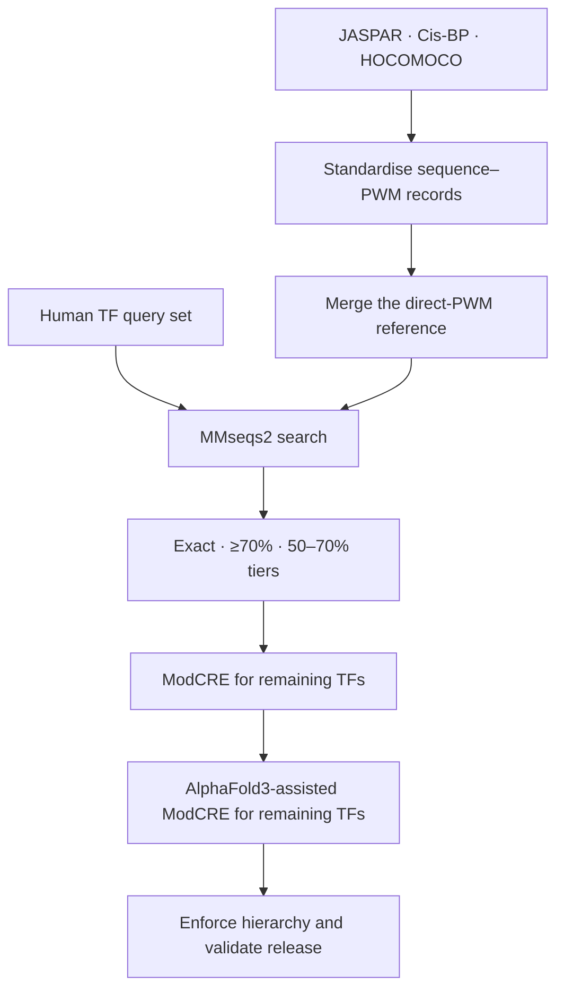

# Hierarchical human TF–PWM annotation

This repository provides a curated table linking human transcription factors (TFs) to experimentally derived position weight matrices (PWMs) or structure-based predictions through a fixed evidence hierarchy.

JASPAR, Cis-BP and HOCOMOCO are treated as three parallel sources of direct PWM evidence. Their records are standardised to the same sequence–motif format, merged into one reference collection and searched together before any inferred annotation is considered.

## Current release

The release contains **5,417 unique TF accessions**. Of these, **5,288 (97.6%)** have one retained annotation and **129** remain unannotated.

| Best annotation level | TFs |
|---|---:|
| Identical PWM | 2,160 |
| Homologous PWM | 1,786 |
| Relatively homologous PWM | 700 |
| ModCRE | 400 |
| AlphaFold | 242 |
| Unannotated | 129 |
| **Total** | **5,417** |

Download the main table: [`data/releases/TF_PWM_chart_final.tsv`](data/releases/TF_PWM_chart_final.tsv)

## Canonical workflow



The retained evidence order is:

1. `Identical_PWM`: direct PWM evidence from an exact sequence match in the combined JASPAR/Cis-BP/HOCOMOCO reference;
2. `Homologous_PWM`: PWM transfer from a sequence match at ≥70% and <100% identity;
3. `Relatively_Homologous_PWM`: PWM transfer from a sequence match at ≥50% and <70% identity;
4. `ModCRE`: structure-based ModCRE model for a TF without sequence-based PWM evidence;
5. `AlphaFold`: AlphaFold3-assisted ModCRE model for a TF still unannotated;
6. `Unannotated`.

Only the highest-priority populated tier is retained for each TF. The 70% and 50% identity cutoffs are project-specific operational thresholds rather than universal biological boundaries.

## Repository structure

```text
.
├── data/
│   ├── releases/           # validated annotation table
│   ├── reference/          # source manifest and TF-family mapping
│   └── model_predictions/  # ModCRE/AF3 logs and exclusion lists
├── scripts/                # canonical processing and validation workflow
├── docs/                   # data dictionary and reproducibility notes
└── .github/workflows/      # automated release validation
```

## Pipeline entry points

The three direct-PWM sources are prepared independently but with the same output schema:

```bash
python scripts/01_prepare_jaspar.py JASPAR.json jaspar.fasta

python scripts/02_prepare_cisbp.py \
  --motifs CisBP_2.00.all.motifs.sql \
  --proteins CisBP_2.00.all.proteins.sql \
  --output cisbp.fasta

python scripts/03_prepare_hocomoco.py \
  --annotation HOCOMOCOv11_core_annotation_HUMAN_mono.tsv \
  --sequences human_tf_sequences.fasta \
  --output hocomoco.fasta

python scripts/04_merge_reference_fastas.py \
  jaspar.fasta cisbp.fasta hocomoco.fasta \
  --output direct_pwm_reference.fasta
```

The combined reference then enters the common annotation workflow:

```bash
bash scripts/05_run_mmseqs.sh \
  human_tf_sequences.fasta direct_pwm_reference.fasta TF_sequences

python scripts/06_build_homology_table.py \
  --queries human_tf_sequences.fasta \
  --comparison TF_sequences.comparison \
  --output TF_PWM_sequence_tiers.tsv \
  --provenance-output TF_PWM_sequence_provenance.tsv

python scripts/07_add_tf_families.py \
  --input TF_PWM_sequence_tiers.tsv \
  --mapping data/reference/TF_accession_family.csv \
  --output TF_PWM_with_families.tsv

python scripts/08_attach_model_predictions.py \
  --input TF_PWM_with_families.tsv \
  --modcre-log data/model_predictions/pwm_execution_modcre_all.log \
  --af3-log data/model_predictions/pwm_execution_af3_all.log \
  --modcre-exclusions data/model_predictions/wrong_model_modcre.txt \
  --af3-exclusions data/model_predictions/wrong_model_af3.txt \
  --output TF_PWM_candidates.tsv

python scripts/09_finalize_release.py \
  --input TF_PWM_candidates.tsv \
  --output TF_PWM_chart_final.tsv
```

Validate the deposited release with:

```bash
python -m pip install -r requirements.txt
python scripts/10_validate_release.py data/releases/TF_PWM_chart_final.tsv
```

## Data and software sources

- [JASPAR](https://jaspar.elixir.no/) (2024 release)
- [Cis-BP](http://cisbp.ccbr.utoronto.ca/) (version 2.00)
- [HOCOMOCO](https://hocomoco11.autosome.org/) (version 11; human CORE mononucleotide models)
- [MMseqs2](https://github.com/soedinglab/MMseqs2)
- [ModCRE](https://doi.org/10.1093/nargab/lqae068)

Input scope is recorded in [`data/reference/SOURCES.tsv`](data/reference/SOURCES.tsv). Field definitions and reproducibility boundaries are documented in [`docs/DATA_DICTIONARY.md`](docs/DATA_DICTIONARY.md) and [`docs/REPRODUCIBILITY.md`](docs/REPRODUCIBILITY.md).
